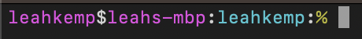

# Pretty command prompt

Making my command prompt pretty with minimal code/avoiding installing a bunch of stuff :)

In regular bash, popping this wee script (provided by [James Ferguson](https://github.com/Psy-Fer)) into my ~/.bashrc file worked great to customize my command prompt

```bash
export PS1="\[\e[00;35m\]\u\[\e[0m\]\[\e[00;97m\]@\[\e[0m\]\[\e[00;35m\]\h\[\e[0m\]\[\e[00;97m\]:\[\e[0m\]\[\e[01;36m\]\W\[\e[0m\]\[\e[00;97m\]:\[\e[0m\]\[\e[00;33m\]\\$\[\e[0m\]\[\e[00;97m\]\[\e[0m\]" 
```

What it looks like:


Pink of course 💅🏻

It gives:

- username
- machine
- directory (shortened to a depth of 1
- a $ to indicate I'm in a bash shell

I've transitioned to working on a mac (macOS Ventura) which uses zsh as 
the default shell. So I needed to update a few things. First I needed to 
utilise ~/.zshrc file in place of a ~/.bashrc file. Secondly, I updated my 
pretty command prompt script to the following:

```zsh
PROMPT='%F{magenta}%n%f%F{white}$%f%F{magenta}%m%f%F{white}:%f%F{cyan}%1d%f%F{white}:%f%F{yellow}%%ß%f'
```

What it looks like:



It gives:

- username
- machine
- directory (shortened to a depth of 1
- a % to indicate I'm in a zsh shell
